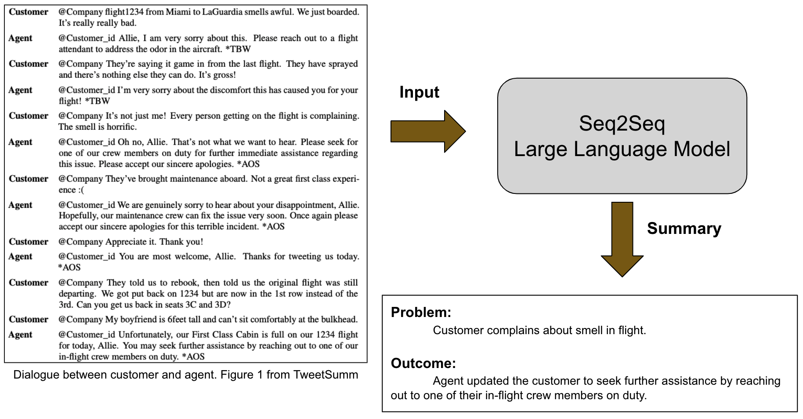

# Chat Summarization Tutorial

We will build a chat summarization pipeline using a seq2seq large language model (like bart) that will train on customer-agent dialogues posted on twitter. The goal is to automatically extract the main problem asked by the customer and the outcome of the dialogue. 

This dataset is based on [TweetSumm](https://arxiv.org/abs/2111.11894) and the model on [HuggingFace](https://huggingface.co/docs/transformers/model_doc/distilbert). The figure below presents an overview.




# Pre-requisites

- Experience in Python and general machine learning 
- A machine with at least 8 GB RAM (A GPU is recommended but not required)

# QuickStart

The 4 steps below will allow us to get the libraries we need for running the code, to train and validate large language models and save their results, and to visualize all saved results on a jupyter notebook.

### 0. Clone this repo

```
git clone https://github.com/IssamLaradji/chat_summarization_tutorial 
```

### 1. Install Requirements
```
pip install -r requirements.txt
```

### 2. Train and Validate

```
python trainval.py
```

### 3. Visualize the results

Open the generated `results.ipynb` file and run the first cell to get the following dashboard of plots.


# Assignment

Run experiments using other huggingface models like Pegasus (known as `google/pegasus-xsum`) and compare them against the models defined in `trainval.py`.

Modify `exp_list` in `trainval.py` under the comment `TODO: Add more models here`, and the run the code, and visualize the results and post them on the `Github Issues` section. 

It would be interesting to see if Pegasus outperforms T5 and BART.
