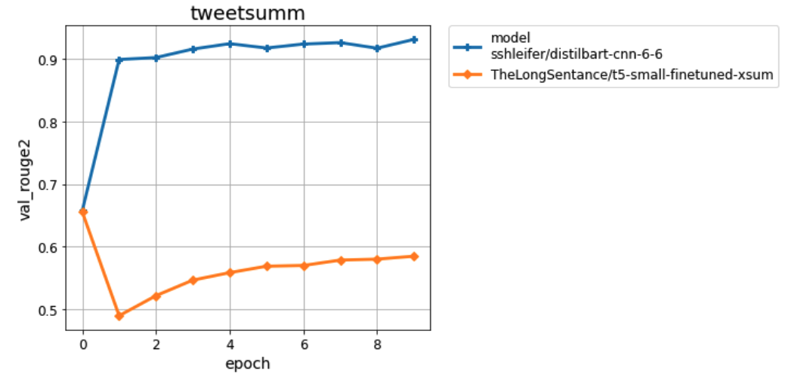

# Chat Summarization Tutorial

We will build a chat summarization pipeline using a seq2seq large language model (like bart) that will train on customer-agent dialogues posted on twitter. The goal is to automatically extract the main problem asked by the customer and the outcome of the dialogue. 

This dataset is based on [TweetSumm](https://arxiv.org/abs/2111.11894) and the model on [HuggingFace](https://huggingface.co/docs/transformers/model_doc/distilbert). The figure below presents an overview.


# Pre-requisites

- Experience in Python and general machine learning 
- A machine with at least 8 GB RAM (A GPU is recommended but not required)

# QuickStart

The 4 steps below will allow us to get the libraries we need for running the code, to train and validate large language models and save their results, and to visualize all saved results on a jupyter notebook.

### 0. Clone this repo

```
git clone https://github.com/IssamLaradji/chat_summarization_tutorial 
```

### 1. Install Requirements

The following command install the libraries required to run this code.

```
pip install -r requirements.txt
```

### 2. Train and Validate


The following command runs and validates two large language models on the tweetsumm dataset and saves the scores in th `results` folder.


```
python trainval.py
```

### 3. Visualize the results

Open the generated `results.ipynb` file and run the first cell to get the following dashboard of plots. They show that distillbart works a lot better than T5 at summarizing dialogues.



# Assignment

Run experiments using other huggingface models like Pegasus (known as `google/pegasus-xsum`) and compare them against the models defined in `trainval.py`.

Modify `exp_list` in `trainval.py` under the comment `TODO: Add more models here`, and the run the code, and visualize the results and post them on the `Github Issues` section. 

It would be interesting to see if Pegasus outperforms T5 and BART.


# Contact me

I am Issam Laradji a Research Scientist as ServiceNow Research and I am currently working on tasks related to natural language processing (NLP) specifically dialogue systems and chat bots.

If you would like to chat or collaborate, you can reach me at [twitter](https://twitter.com/ILaradji) or [LinkedIn](https://www.linkedin.com/in/issam-laradji-67ba1a99/).